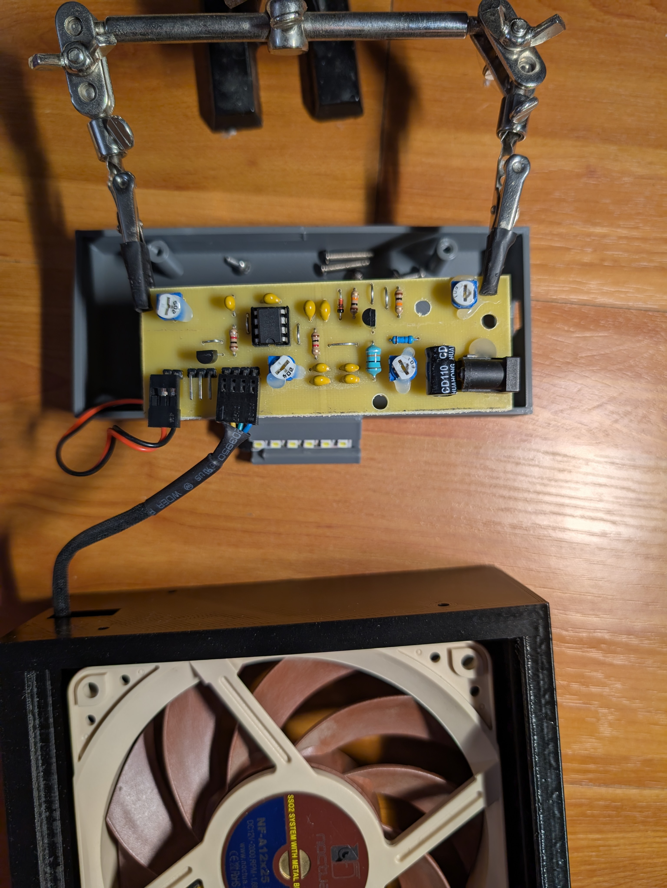
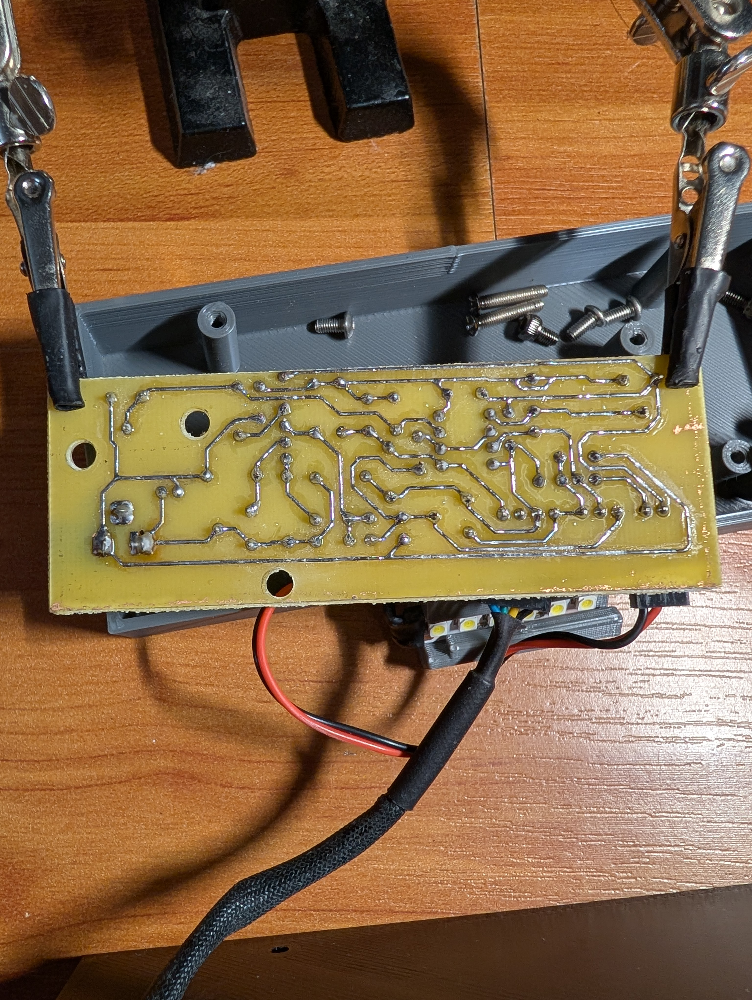

# Fume Extractor
This Solder Fume Extractor uses a 12V Noctua fan, controlled by a PWM signal generated by a Colpitts sinusoidal oscillator circuit. The extractor also includes an LED strip to illuminate the working area. To maximize efficiency, the LED strip is also controlled via PWM, rather than using a linear regulator.

While this project could be simplified with a microcontroller, such as an ATtiny or ATmega, to generate the PWM signal, the goal is to explore generating a square wave with a controllable duty cycle using purely analog circuitry.

## Schematic
[schematic](Schematic.pdf)

## PCB
.png)
.png)

## Final Product

