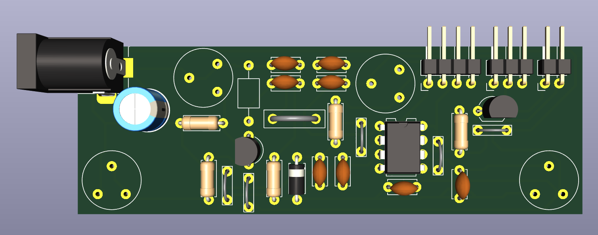
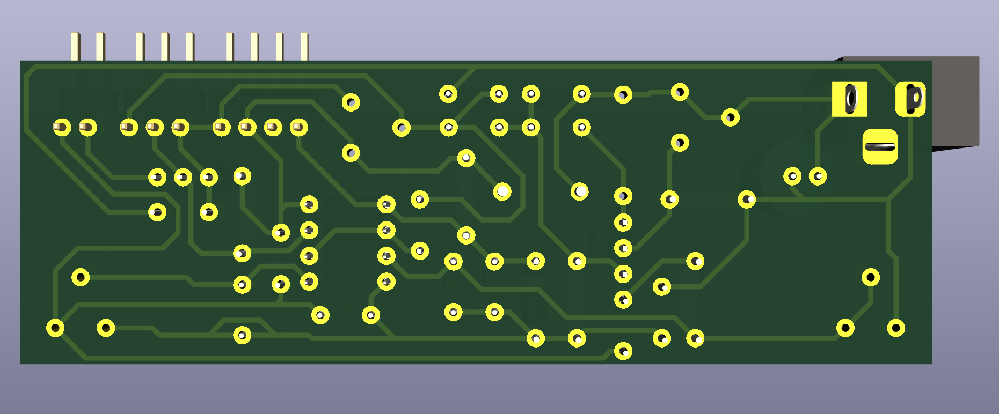
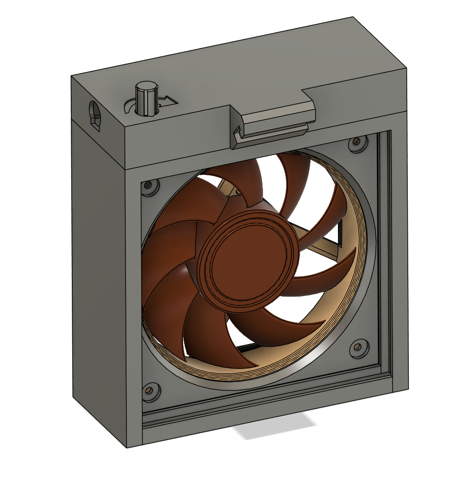

# Fume Extractor
This Solder Fume Extractor features a 12V Noctua fan, with speed controlled by a PWM signal generated by a Colpitts sinusoidal oscillator circuit. The frequency generated is close to 25kHz, which is required by the Noctua fan. It also includes an LED strip to illuminate the workspace, with its brightness similarly controlled via PWM for greater efficiency. Since the supply voltage is 12V, using a linear regulator is inefficient and would create a lot of heat.

***Note***: Although this project could be greatly simplified by incorporating a microcontroller, like an ATtiny or ATmega, to generate the PWM signals for both the fan and LED strip, the aim here is to explore how to generate a square wave with a controllable duty cycle using entirely analog components.

## [Schematic](KiCad/Schematic.pdf)

## PCB

## 3D Model

## Finish

